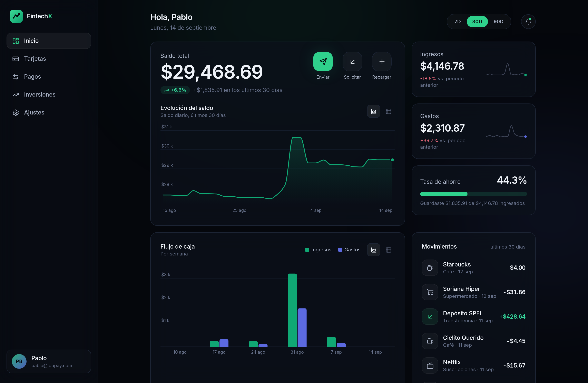
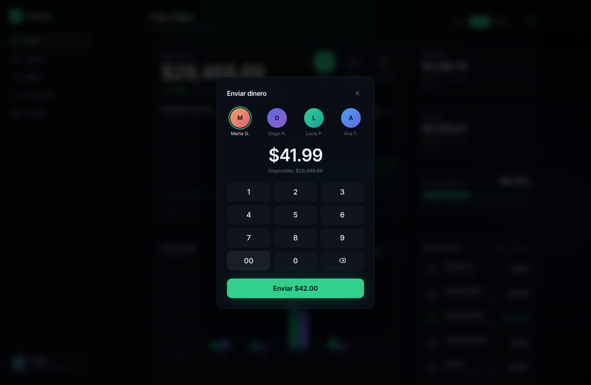

# FintechX

Front-end de una app de servicios financieros, pensado para animaciones de alto nivel y una experiencia de usuario premium.



## El stack y por qué

| Pieza | Elección | Por qué |
| --- | --- | --- |
| UI | **React 19 + TypeScript (estricto)** | El ecosistema más sólido para producto financiero (TanStack Table/Query, visx…), tipado estricto para manejar dinero sin sustos y el mayor mercado de talento. |
| Build | **Vite 8** | Arranque y HMR instantáneos, builds de producción en ~1 s, cero configuración. |
| Estilos | **Tailwind CSS v4** | Sistema de diseño por tokens (`@theme` en CSS), iteración rapidísima y CSS final mínimo. Todos los colores/tipografías viven en `src/index.css`. |
| Animación | **Motion 13 (Framer Motion)** | La referencia en animación para React: springs físicos, `layoutId` (indicadores que se deslizan entre elementos), `AnimatePresence` (transiciones de salida), gestos y dibujado de paths SVG. |
| Iconos | **lucide-react** | Set consistente, tree-shakeable. |
| Tipografía | **Inter Variable** (autohospedada vía `@fontsource`) | La sans de facto en fintech; sin peticiones a terceros. |

Se eligió SPA con Vite (y no Next.js) porque una app financiera vive detrás de login: no necesita SSR/SEO y así el stack queda más simple y portable. Si más adelante hay páginas públicas de marketing, pueden vivir en un proyecto aparte.

## Qué incluye el starter

- **Dashboard completo** (`Inicio`): saldo con contador de muelle físico, acciones rápidas, gráfica de evolución del saldo, flujo de caja con granularidad adaptativa (día/semana/mes), métricas con sparklines, medidor de tasa de ahorro y lista de movimientos.
- **Filtro de rango global (7D/30D/90D)**: un solo estado gobierna todo lo que hay debajo — todas las tarjetas y gráficas re-derivan del mismo corte de datos, así los números siempre cuadran.
- **Flujo de transferencia** con modal animado: contactos con anillo `layoutId`, teclado numérico estilo cajero (se escribe en centavos), estado de envío y éxito con check dibujado en SVG.

  

- **Gráficas SVG propias animadas con Motion** (sin librería de charts): control total de las marcas y del dibujado de entrada. Interpolación cúbica **monótona** para la curva de saldo (sin overshoot: nunca dibuja saldos que no existieron), crosshair + tooltip con muelle, navegación por **teclado** (flechas) y conmutador **gráfica ⇄ tabla** en cada chart como gemelo accesible.
- **Accesibilidad de serie**: `prefers-reduced-motion` respetado globalmente (`MotionConfig reducedMotion="user"`), roles/etiquetas ARIA, foco visible, y paleta de series **validada para daltonismo** (ΔE deutan 23.8, visión normal 27.4, contraste ≥ 3:1 sobre la superficie oscura). Si cambias `--color-series-*` o `--color-panel`, vuelve a validar el conjunto.
- **Datos mock deterministas** (PRNG con semilla) en `src/data/mock.ts` y una capa de selectores en `src/data/derive.ts` — el punto natural para enchufar la API real más adelante.

## Correr el proyecto

```bash
npm install
npm run dev       # desarrollo con HMR
npm run build     # typecheck + build de producción
npm run preview   # sirve el build
npm run lint      # oxlint
```

## Estructura

```
src/
├── index.css          # Tokens de diseño (colores, fuente, tarjeta base)
├── App.tsx            # Shell: nav, vistas, modal, MotionConfig
├── lib/               # format (dinero/fechas), chart (ticks, curvas), useMeasure
├── data/              # mock determinista + selectores derivados por rango
├── components/        # AnimatedNumber, charts, tiles, nav, modal…
└── features/          # Vistas: DashboardView, PlaceholderView
```

- **Moneda y locale** se cambian en un solo lugar: `src/lib/format.ts`.
- La navegación entre secciones usa estado local con transiciones `AnimatePresence`; las secciones fuera de `Inicio` son placeholders listos para crecer.

## Co-brand (Banco Amazonas × Tether)

Los assets de marca viven en `src/assets/` (el favicon, en `public/`):

| Archivo | Uso |
| --- | --- |
| `ba-logo-white.png` | logo horizontal negativo (marca roja + wordmark blanco, para fondos oscuros): header y reverso de la tarjeta |
| `ba-logotipo.png` | isotipo rojo: favicon y pie de la pantalla Tarjetas |
| `tether.svg` | logo de Tether (rebrand 2024, recoloreado a `#009393`): sello co-brand del header y badge USDT de la tarjeta |
| `bitcoin.svg` / `usdcoin.svg` | logos de activos en la lista del portafolio |

Se descargaron de bancoamazonas.com y tether.to. Para usar el kit de marca oficial basta con
reemplazar esos archivos conservando los mismos nombres: ningún componente cambia. Los colores
verificados de ambas marcas viven como tokens en `src/index.css` (`--color-bank` `#C00D0D`,
`--color-bank-bright` `#E82121`, `--color-tether` `#26A17B`, `--color-usdc` `#2775CA`,
`--color-bitcoin` `#F7931A`).

## Próximos pasos sugeridos

- Router real cuando haya más pantallas: **TanStack Router** (o React Router).
- Datos remotos: **TanStack Query** sobre `src/data/` (la forma de los selectores ya lo anticipa).
- Tests: **Vitest + Testing Library** para componentes y selectores.
- Autenticación, i18n (`Intl` ya centralizado) y Storybook si el design system crece.
